# Hogwarts School Website

## Site Overview

This website is the landing page for the fictional school Hogwarts from the Harry Potter franchize. The aim for the site is to advertise the school to potential parents and students, giving them a view of what they could expect from their time at Hogwarts. There is information on the different classes availible, the four Hogwarts Houses and the staff and teachers who work within the school. 

The official address: [Hogwarts School Website](https://claire221.github.io/Hogwarts-Landing-Page/)

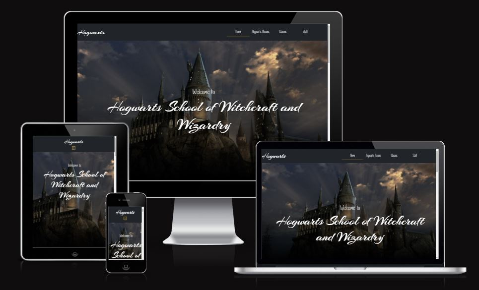

## UX

Throughout the website I wanted the design to be simple and easy to understand. I knew I was going to be using a lot of art and imagery throughout the site so I wanted the background colours to be darker so that the art work would pop out. 

### User Stories

- As a user I want an informative website thats easy to read
- As a user I want a website that teaches me more about the school and what it stands for
- As a user I want a website that is easily navigated and intuitive
- As a user I want to see what the students might learn at the school

### Colours 
Throughout the website I want the theme to be dark with a pop of bright colours.

For the homepage I used a black background with an accent colour of dark maroon for the section paragraph backgrounds to make them stand out. After I added the colours I thought it looked a bit flat so I decided to slightly darked then background color as you went down the page to make it more visualy interesting. The first paragraph background was a light maroon color, the second one a mid tone and finally the last one a dark maroon colour. 

For the other pages I wanted to uses pops of color in the section that matched the images corelating to them, for the Hogwarts Houses page I used the staple colour of each Hogwarts house as the background. 

For the Lessons page I tried to pick out a colour that was in the background of each image and use that so both the image and the paragraph looked like they belonged together.

For the Staff members page I wanted to keep it fairly simple as not to draw attention away from the portraits or make the page to chaotic so I went with a simple white border around each profile card and a white background to the staff member description paragraph.

#### Main colours throughout the site

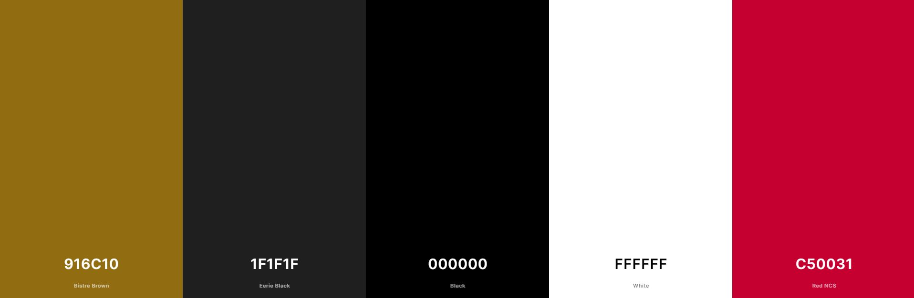

#### Hogwarts houses page colours

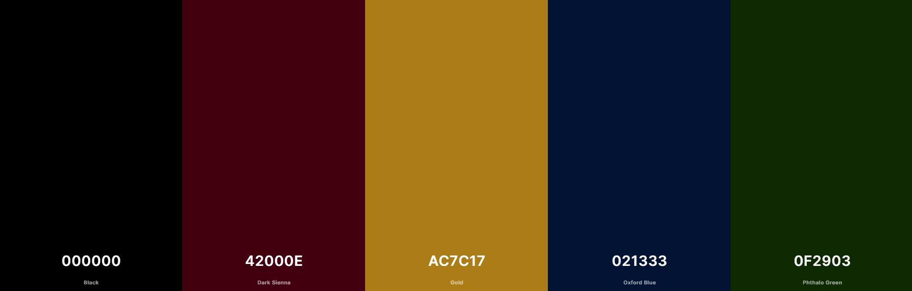

#### Hogwarts classes page colours

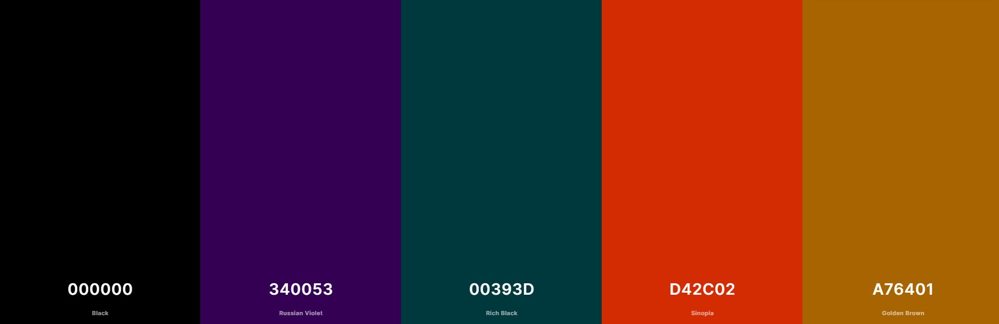

#### Hogwarts staff page colours

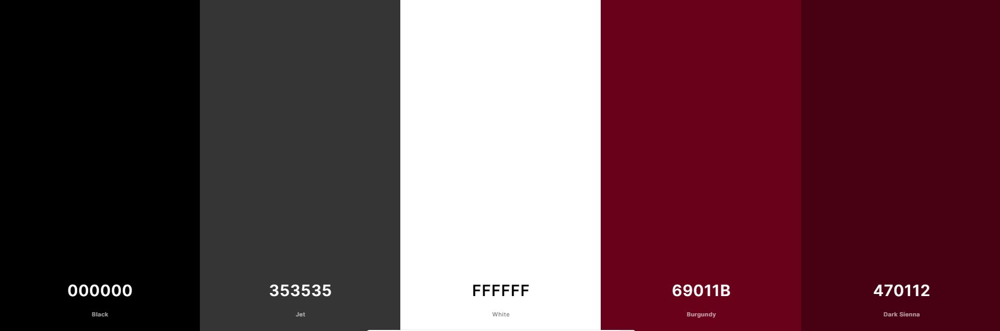

### Typography 

I used two main fonts throught the website, one for the logo and one for all the other text. Because the site doesnt have an official logo I wanted the brand name to stand out and act as if it was the logo. For the Hogwarts brand title I wanted a font that played on the magic theme of the website, I wanted something the looked like it could have been written with a quill but wasnt too flamboyant or hard to read. After trying out a few different fonts I decided to go with Arizonia.
[Arizonia font](https://fonts.google.com/specimen/Arizonia?query=Arizonia)

For the rest of the text throughout the website I decided to use the same font - Zen Loop as to not over complicate things and keep it all readable. I choose this font because its lightweight while also having some stylized aspect to it with some of the letters having curls and character which I thought fit in well with the theme of the website.
[Zen Loop](https://fonts.google.com/specimen/Zen+Loop?query=Zen+Loop)

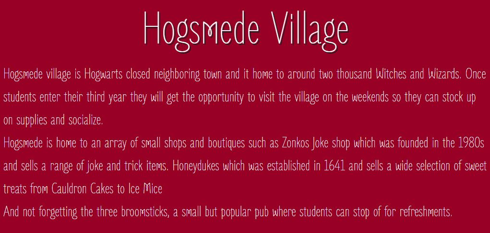

I also used two font awesome icons in my footer for links to a wand shop and also a book shop. I went with these icons because I wanted it to be representitive of the school giving students website to buy their school supplies from. 
[Broom icon](https://fontawesome.com/icons/broom?s=solid)
[Book icon](https://fontawesome.com/icons/book?s=solid)

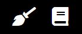

### Wireframes

I started the design process my sketching down my idea in its simplist form so I could get a feel for what layout style I thought would work best. I then went on to use an online wireframe website Basamiq to create the wireframes which I would work off throughout the project.

#### Homepage Wireframes

#### Hogwarts Houses Page Wireframes

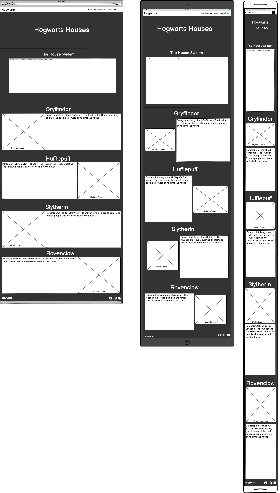

#### Hogwarts Lessons Page Wireframes

#### Hogwarts Staff Page Wireframes

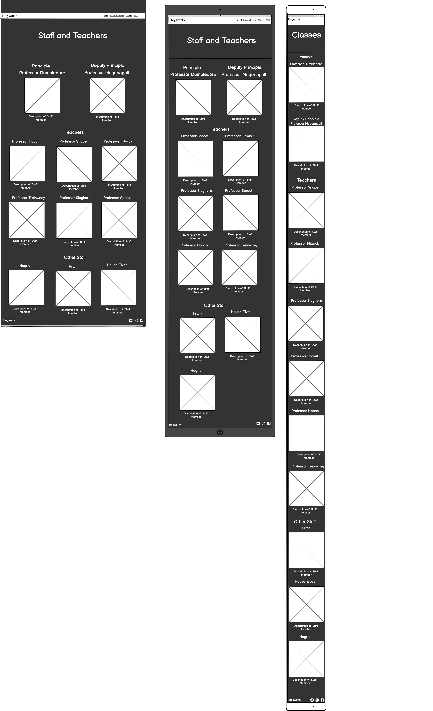

## Features

For this project I wanted to create a mock website for Hogwarts School. I wanted the website to mimic what the real website might be like for the school, including information about the school, classes and teachers. Its aim is to be a place for prospective students and parents to go to for information to see if they like the school and potentially want to enroll there. 

### Existing Features

#### Common Features

For the navigation I used a dark coloured navbar so that it fit in with the rest of the pages background colour. On the far left I have the Hogwarts logo and then on the far right I have the links to the other pages of the website. All of the elements in the navbar have a hover effect so that the user knows what area they are currently hovering over, and each page has an active state so that you can tell by looking at the navbar what page you are currently on. 

For the footer I wanted to keep it fairly simple, on the right hand side is the school logo which when clicked will take you back to the top of the page and on the right side is two font awesome icons, a book and a broom. The broom icon takes you to the wizarding world shops broom section and the book takes you to the book section. I wanted these icons to imitate a like that the school might include to show students where they can buy school supplies from. 

#### Home Page

For the header of the home page I wanted something that would catch someones attention as its the first thing they will see, I decided to do a hero image of Hogwarts Castle and I added a slight zoom effect to it. I also added two headings which welcome you to the page. 

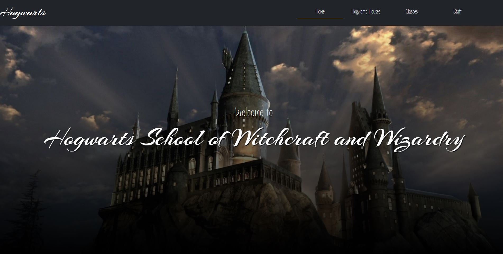

Under the header I have an about section that contains a breif paragraph explaining the school and what students might expect when studying there. 
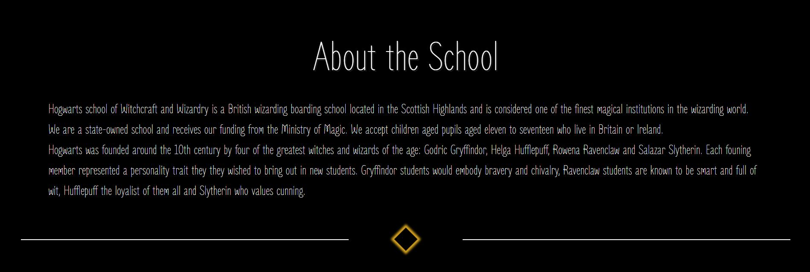

For the information on the home page I decided to go with a card format. Each card had a paragraph that gave a small description of the topic and then a picture which corelated with the information in the paragraph. I decided to give each paragraph background a colour so that it stood out against the black page background and was easier to read. 
For the images I decided to go with an art style rather than a realistic photograph, I chose this design because I found that they were a lot more colourful so stood out on the page more, I also thought it gave the page a nice feel. 

Between each card I decided to add a Hr to break up the sections a bit. When I first created the cards I thought they were a bit bunched together so I started by adding a margin between them, I then felt that this made the page look a bit empty as there were big empty gaps between each section so I decided to go in with a HR. I didnt want the HR to be plain and boring because I didnt think that would fit in with the magical theme of the website so I decided to do something a bit different by creating a diamond shape in the middle.

#### Hogwarts Houses Page

For the Hogwarts house page I wanted to keep the style the same as the homepage so that they felt like a cohesive piece and part of the same website. The tricky part was find art that not only fit the style I was looking for but made sense with the information on the page. For the header I managed to find an image of the sorting hat in Dumbledores office so I included that and then a page title with the page name. 

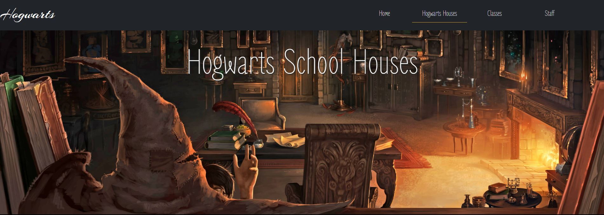

Under the header there is a paragraph the gives an overview of the Hogwarts houses and why they were created, you can then scroll down the page for more information on each individual house. I added this paragraph to help add some space between the header images and the cards below so that it didnt look to chaotic, I also thought it was nice to add a small into paragraph to let the reader know what to expect from the page.

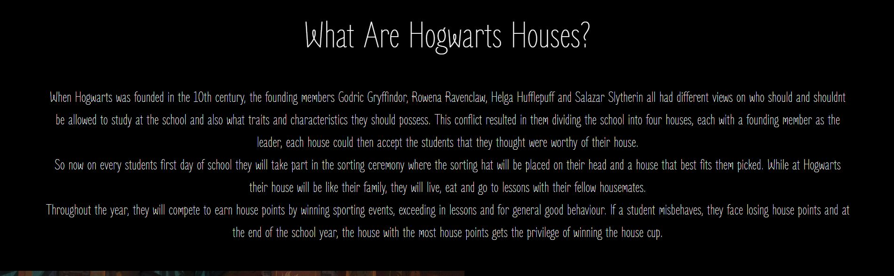

For the card section I kept the style and format the same as on the homepage, I had a paragraph giving a description of each house along with an image corelating to it. Initially I wanted to put images of the house crests however I was only able to find three out of the four crests in the art style I was going for and thought it looked dis-conjoined if I used a different image on the last house. For that reason I decided to go with images that reflected each houses common room, although it wasn’t my initial idea I still think it turned out well as the common rooms are a big part of each house as they are where students spend a lot of time. Each common room is also decorated in a different style that fits the theme of each house so I thought it gives the viewer an idea of what the houses represent. I also coloured the paragraph sections with the main colour from each houses logo to tie it all together. 

Between each card section I decided to add a break to add some space so that the cards werent all ontop of eachother, I didnt want to just add white space because I thought that might look a bit weird so I decided to add some stars because I felt like that went with the magic theme of the website. 

#### Hogwarts Class Page

Again with the classes page I kept it very similar to the previous two pages as it was important to me that the pages as a whole felt like they are part of the same piece.
For the header section I managed to find an art work the represented a class setting so I decided to go with that. Because the image is brighter than the background I think it makes the heading section stand out.   

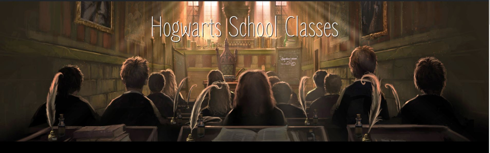

For the card section I kept the layout the same as the pervious pages. This time for the images I found artwork that depicted each classroom to give a feel for what the classes might be like. I also coloured the paragraph section with a colour from the image, I chose a colour that wasn’t as prominent so that it was a bit of a contrast. 

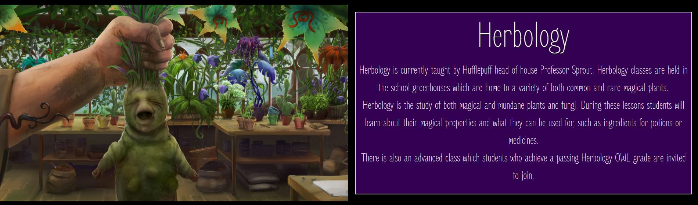
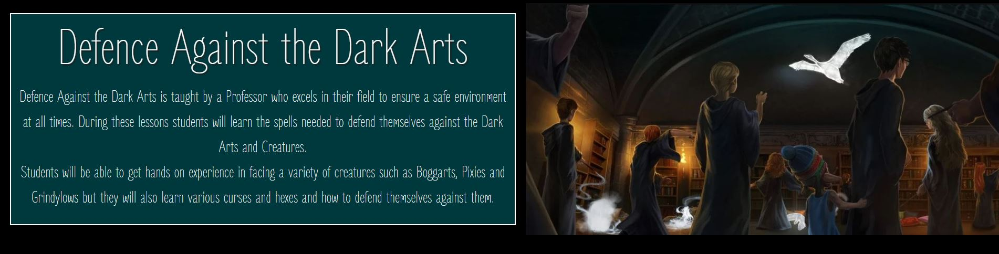
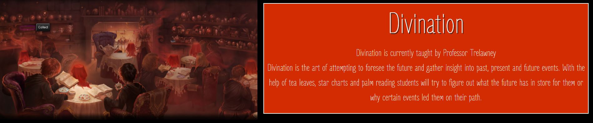
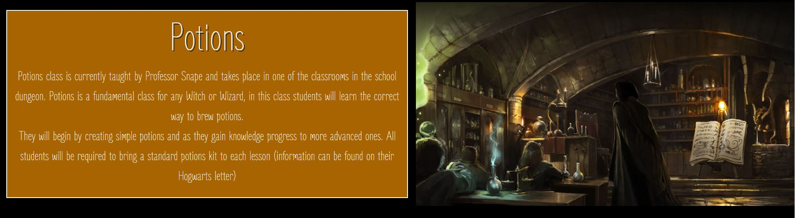
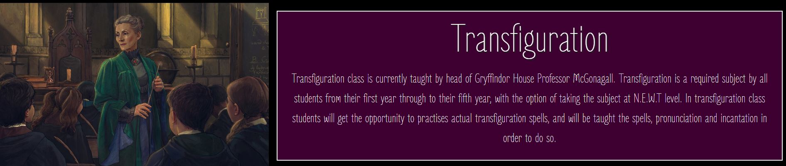
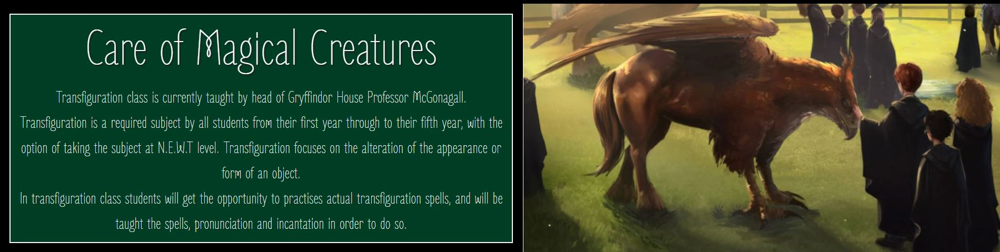

#### Staff and Teachers page

For the staff and teachers page I mixed up the layout slightly, I still went with a cards design, but I went with more of a gallery or portfolio layout. For the header section I wanted a staff group photo, I wanted to give the feel that the staff had all got together to have a photo drawn or painted for it to be used on the school website. 

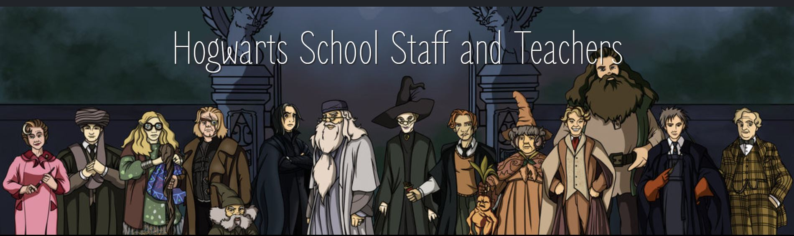

For the cards on the page I wanted to have their title, name and a brief description included. Also for the image I used real photos rather than artistic ones as I thought it made more sense to have genuine photos.

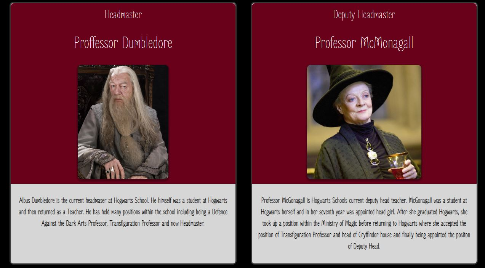

## Technologies Used

Throughout the project I used a variety of technologies.

- I used HTML and CSS to create and style the website.
- I used Bootstrap to create a responsive navbar. [Bootstrap Website](https://getbootstrap.com/)
- I used github to create a repository for my project.[github Website](https://github.com/)
- I used gitpod as the development environment.[gitpod Website](https://www.gitpod.io/)
- I used github pages to host the website.[github pages Website](https://pages.github.com/)
- I used Balsamiq to design my wireframes.[Balsamiq Website](https://balsamiq.com/)

## Testing
I have created a seperate document for the tests I conducted, it can be found [Here](TESTING.md)

## Deployment

The site was deployed to GitHub pages. The steps to deploy are as follows: 
  - In the [GitHub repository](https://github.com/Claire221/Code-Institute-Milestone-Project-1), navigate to the Settings tab 
  - From the source section drop-down menu, select the **Main** Branch, then click "Save".
  - The page will be automatically refreshed with a detailed ribbon display to indicate the successful deployment.

The live link can be found [here](https://claire221.github.io/Code-Institute-Milestone-Project-1)

### Local Deployment

In order to make a local copy of this project, you can clone it. In your IDE Terminal, type the following command to clone my repository:

- `git clone https://github.com/Claire221/Code-Institute-Milestone-Project-1.git`

Alternatively, if using Gitpod, you can click below to create your own workspace using this repository.

## Credits
### Text
For the information on the website about the school, staff and teachers I mainly got it from two sources
- [Harry Potter Fandom](https://harrypotter.fandom.com/)
- [fandom.com](https://www.fandom.com/)

### Content
Throughout the website I used a variery of images and artworks. 
#### Homepage
- [Header Hogwarts castle image - Website link](https://screenrant.com/harry-potter-hogwarts-movies-missing-details/)
- [Header Hogwarts castle image - Website Image](https://static0.srcdn.com/wordpress/wp-content/uploads/2019/02/Hogwarts-Featured.jpg)
- [Hogsmede Village image](https://www.deviantart.com/nieris/art/Hogsmeade-670092533)
- [Hogwarts Crest image](https://www.deviantart.com/linnpuzzle/art/Hogwarts-Crest-453296620)
- [Lesson Section image](https://atomhawk.com/pottermore)

#### Hogwarts Houses Page
- [Houses page header image](https://www.wizardingworld.com/writing-by-jk-rowling/hatstall)
- [Gryffindor Common room image](https://www.artstation.com/artwork/v2Amyd)
- [hufflepuff Common room image](https://www.artstation.com/artwork/OyGQ9k)
- [Ravenclaw Common room image](https://www.artstation.com/artwork/oRknL)
- [Slytherin Common room image](https://www.artstation.com/artwork/xPPwr)

#### Hogwarts Classes Page
- [Classes page header image](https://www.wizardingworld.com/writing-by-jk-rowling/hogwarts-school-subjects)
- [Herbology Lesson Art](https://www.wizardingworld.com/features/health-hazards-herbology)
- [Defence Against the Dark Arts lesson art](https://www.wizardingworld.com/features/what-is-a-patronus)
- [Divination lesson art](http://guide-to-pottermore-items.blogspot.com/2013/02/poa-chp-6-divination.html)
- [Potions lesson art](https://www.deviantart.com/xxtayce/art/Pottermore-Background-Potions-Class-417719888)
- [Transfiguration lesson art](https://www.artstation.com/artwork/Bm0e8k)
- [Care of Magical Creatures lesson art](https://harrypotter.fandom.com/wiki/Care_of_Magical_Creatures)

#### Staff and Teachers Page
- [Staff page header image](https://www.bloghogwarts.com/2012/06/15/si-tus-profesores-fuesen-como-los-de-hogwarts/)
- [Dumbledore image](https://www.wizardingworld.com/features/things-you-may-not-have-noticed-about-albus-dumbledore)
- [McGonagall image](https://www.vulture.com/2018/09/minerva-mcgonagall-harry-potter-twentieth-anniversary.html)
- [Snape image](https://ultimatepopculture.fandom.com/wiki/Severus_Snape)
- [Madame Hooch image](https://harrypotter.fandom.com/wiki/Rolanda_Hooch)
- [Flitwick image](https://www.harrypotterfanzone.com/pictures/professor-flitwick-in-class/)
- [Trelawney image](http://thegrandmalogbook.blogspot.com/2020/04/sybill-trelawney-prophecies-since.html)
- [Lockheart image](https://aminoapps.com/c/harry-potter/page/blog/why-gilderoy-lockhart-wanted-to-teach-dada/xZT2_uxXj180BVQeZ7p165MYZPzvnP)
- [Sprout image](https://harrypotter.fandom.com/wiki/Pomona_Sprout)
- [Hagrid image](https://en.wikipedia.org/wiki/Rubeus_Hagrid)
- [Filch image](https://thewordexplorer.blog/2015/03/07/harry-potter-characters-argus-filch/)
- [Madame Pomfrey image](https://www.pinterest.co.uk/pin/4503668365085602/)

### Media
- Home Page HR - [Youtube link](https://www.youtube.com/watch?v=mjDek0d1kak)