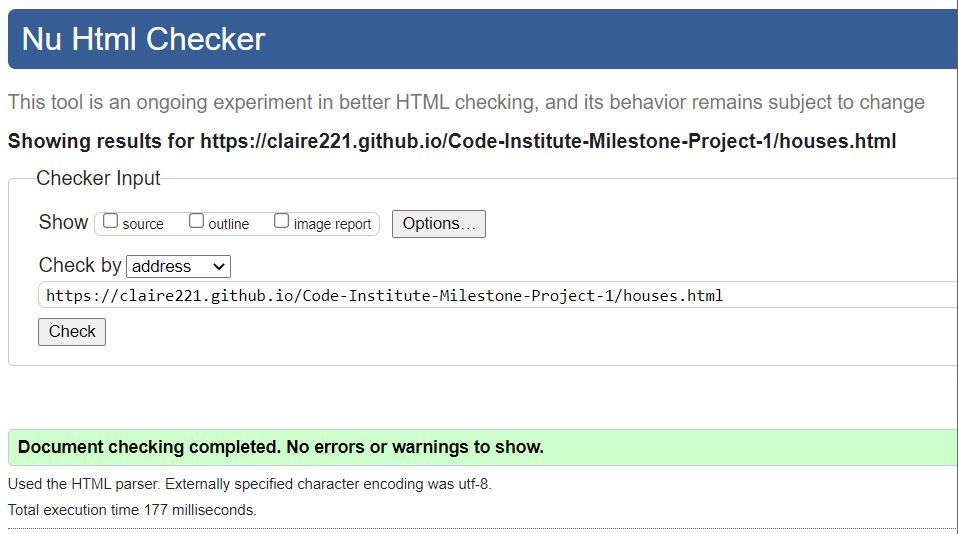
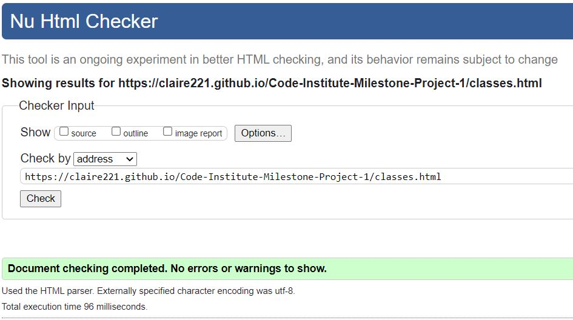
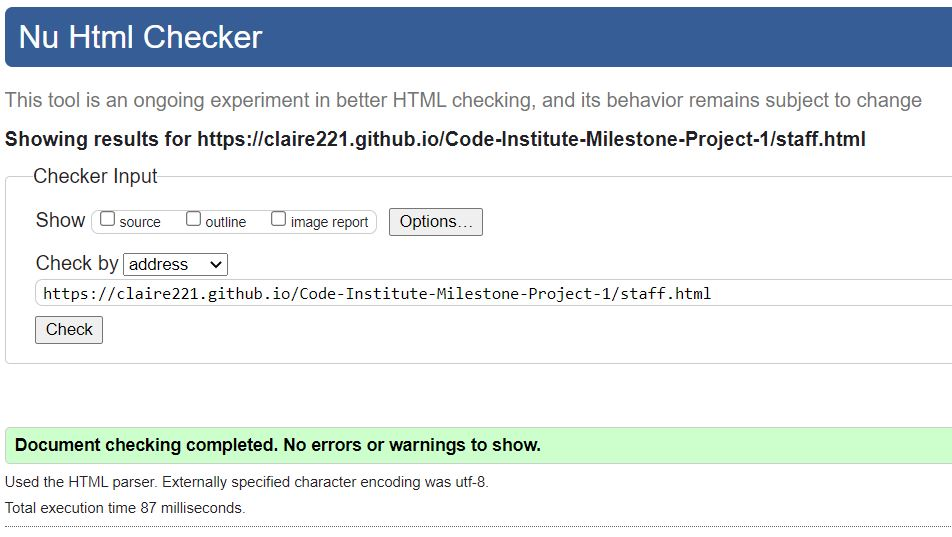
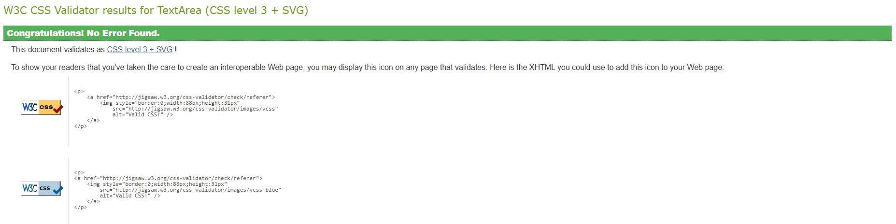
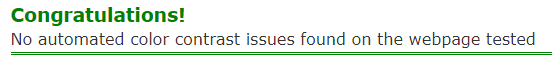

# Testing Phase

"Click to return back to the [README.md](README.md)"

## Browser Testing

For each of my pages I will check them against the top 3 web browsers - Google chrome, Firefox and Microsoft Edge.
I initialy checked that all the elements were loading as they should on all 3 browsers.
Once I confirmed they were working as expected I then went into the devtools and changed the viewport width to check the layout and styles against different device sizes.

| Browser        | Screen Size | Image |
| :----:         |    :----:   | :----:|
| Chrome         | Desktop     |  | 
| Firefox        | Desktop     |  |
| Microsoft Edge | Desktop     |  |
|                |             | 
| Chrome         | Ipad        |  | 
| Firefox        | Ipad        |  |
| Microsoft Edge | Ipad        |  |
|                |             | 
| Chrome         | Mobile      |  | 
| Firefox        | Mobile      |  |
| Microsoft Edge | Mobile      |  |

## Code Validation

### HTML testing

Once I had finished my website I ran each page throigh a HTML validator to ensure that the code was correct.

#### Home Page

#### Houses Page

#### Classes Page

#### Staff Page

### CSS Testing

I ran my CSS through a validator to ensure that it was correct. It passed the validation and came back with no errors.

## Acessability Testing

I ran each of my pages through an colour accessibility website found [Here](https://color.a11y.com/?wc3)
Because my pages have a dark background with coloured paragraphs I wanted to check that there were no contrast issues that could cause people to have dificulty reading the text.
All of my pages passed the validation checker.

#### Home Page

#### Houses Page

#### Classes Page

#### Staff Page

## Bugs

When I was testing my website I noticed that there was a problem with the bootstrap nav bar, when you went to smaller viewports it was collapsing but the hamburger menu wasnt working and when you clicked on it nothing happened. 

The first way I tried to fix it was to re put in the navbar template from bootstrap incase a change I had made had caused an issue, so I copied and pasted the code from bootstap and didnt change any of the classes or template text. I tried the different viewports again and the navbar hamburger menu still wanst working, this told me though that it wasnt an error with the HTML code.

Next I thought it might be an erorr with the CDN I had imported and this turned out to be correct, after trying a few recomended ones from Stack overflow and not having any luck I went back to the Bootstrap documentation and realised I had imported the wrong JavaScript file, I swapped out the one I already have with the new one and it fixed the issue.

## Deployment

The site was deployed to GitHub pages. The steps to deploy are as follows: 
  - In the [GitHub repository](https://github.com/Claire221/Code-Institute-Milestone-Project-1), navigate to the Settings tab 
  - From the source section drop-down menu, select the **Main** Branch, then click "Save".
  - The page will be automatically refreshed with a detailed ribbon display to indicate the successful deployment.

The live link can be found [here](https://claire221.github.io/Code-Institute-Milestone-Project-1)

### Local Deployment

In order to make a local copy of this project, you can clone it. In your IDE Terminal, type the following command to clone my repository:

- `git clone https://github.com/Claire221/Code-Institute-Milestone-Project-1.git`

Alternatively, if using Gitpod, you can click below to create your own workspace using this repository.

